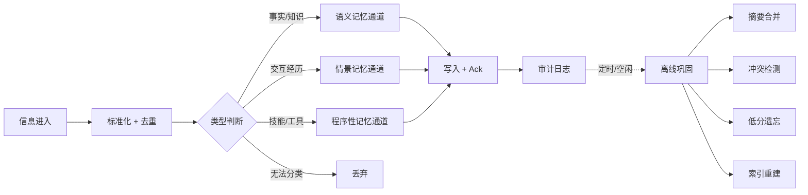

# 记忆存储 — 总纲

## 一句话

记忆存储管 AI 智能体接收信息后如何分流、存储、检索、巩固、遗忘的完整生命周期。

## 整体流程

## 记忆类型

| 类型 | 存什么 | 生命周期 | 检索方式 |
|------|--------|----------|----------|
| 语义记忆 | 事实、概念、知识 | 固化后不淡出，除非被替代 | 向量相似度 |
| 情景记忆 | 对话、交互经历 | 随强度衰减，淡出到冷存储 | 三层检索（字面+双链+向量） |
| 程序性记忆 | 工具调用、技能 | 只增不减 | 按工具名称检索 |

## 设计原则

1. **物理隔离** — 三种记忆类型分属不同存储，严禁混合检索
2. **软删除** — 记忆永不硬删除，只降状态
3. **元数据完整** — 任何写入必须带 source_id、timestamp
4. **先固化后遗忘** — 未固化的记忆永不降级
