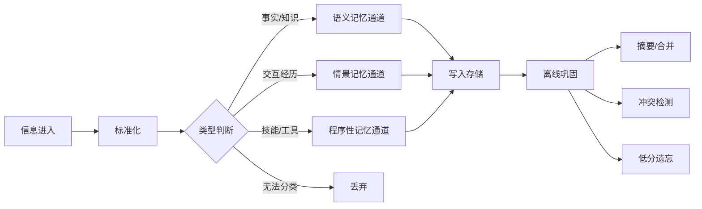

# 记忆存储需求文档（v0.1 — 基础流程图）

> **版本**: v0.1
> **日期**: 2026-07-06
> **来源**: genesis/ 下全部 4 份文档的综合
> **状态**: 大纲草案，待双方确认

---

## 整体流程

### 流程说明（极简版）

1. **信息进入** — 对话、文件、外部推送、系统日志
2. **标准化** — 格式统一、去重
3. **类型判断** — 语义 / 情景 / 程序性 / 垃圾
4. **写入存储** — 各通道独立写入
5. **离线巩固** — 定期执行：摘要合并、冲突检测、低分遗忘

---

## 记忆类型

| 类型 | 存什么 | 生命周期 |
|------|--------|----------|
| 语义记忆 | 事实、概念、知识 | 固化后不随时间淡出 |
| 情景记忆 | 对话、交互经历 | 随强度衰减，淡出到潜意识 |
| 程序性记忆 | 工具调用、技能 | 只增不减 |

---

## 核心铁律

1. **没固化不准忘** — 未消化的记忆永不降级
2. **软删除** — 记忆只降状态，不硬删除
3. **元数据 100% 完整** — 任何写入必须带 source_id、timestamp
