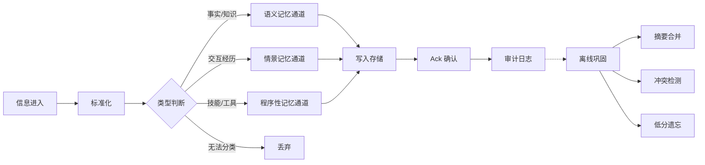

# 记忆存储需求文档（v0.2 — 步骤展开）

> **版本**: v0.2
> **日期**: 2026-07-06
> **来源**: genesis/ 下全部 4 份文档的综合
> **状态**: 草案，待双方确认

---

## 1. 整体流程

---

## 2. 各步骤详述

### 2.1 信息进入

**触发源**：

| 源 | 示例 |
|----|------|
| 用户对话 | 聊天消息 |
| 上传文件/文档 | 笔记、文章 |
| 外部 API 推送 | 系统通知 |
| 系统日志/行为 | 工具调用记录 |

### 2.2 标准化

- 格式统一（txt / json）
- 去重（MD5 指纹比对，重复内容拒绝入库）

### 2.3 类型判断

根据内容特征分流到三个通道：

| 类型 | 判断依据 | 目标通道 |
|------|----------|----------|
| 事实/知识 | 陈述性内容、可验证 | 语义记忆 |
| 交互经历 | 对话轮次、用户-AI 交互 | 情景记忆 |
| 技能/工具 | 工具调用、API 请求 | 程序性记忆 |
| 垃圾 | 无法归类、低质噪声 | 丢弃 |

### 2.4 写入存储

每个通道独立写入，写入后返回 Ack 确认。

### 2.5 审计日志

记录操作人、时间、数据量、耗时。永久留存。

---

## 3. 记忆类型详述

### 3.1 语义记忆（事实/知识）

**存什么**：事实、概念、文档知识。

**写入流程**：

1. 文档切块（按语义边界，段落或句子）
2. 向量化（embedding）
3. 元数据标注（source_id、timestamp、doc_type、version）
4. 写入向量存储

**生命周期**：固化后不随时间淡出，除非被新版本替代（软标记 deprecated）。

### 3.2 情景记忆（交互经历）

**存什么**：对话历史、交互片段。

**写入流程**：

1. 结构化打包（user_id、timestamp、user_input、ai_output、emotion_tag）
2. 重要性评分（互动时长×0.4 + 紧急度×0.3 + 重复提及×0.3）
3. 写入关系存储

**生命周期**：随强度衰减，淡出到冷存储（潜意���）。

### 3.3 程序性记忆（技能/工具）

**存什么**：工具调用日志、成功率统计。

**写入流程**：

1. 工具调用日志打包（user_id、tool_name、params、result、success_flag）
2. 成功率统计聚合（同一工具的成功率/平均耗时）
3. 写入行为存储

**生命周期**：只增不减。同一工具的记录不断累积，用于后续推荐。

---

## 4. 离线巩固

**触发**：定时（每日凌晨 2:00）或空闲时。

**任务池**：

| 任务 | 触发条件 | 说明 |
|------|----------|------|
| 低分记忆清理 | 每次巩固 | importance < 0.2 且距今 > 90 天 → 软删除（归档） |
| 向量索引重建 | 新增文档 > 1000 篇 | 重新计算向量索引 |
| 对话摘要合并 | 每次巩固 | 同一用户的 N 轮对话 → 1 条高阶摘要 |
| 冲突检测与标注 | 每次巩固 | 同一实体出现新版本 → 标记旧版为 deprecated |

**约束**：执行时长 ≤ 30 分钟，超时中断。

---

## 5. 核心铁律

1. **没固化不准忘** — 未固化的记忆永不降级
2. **软删除** — 记忆只降状态（active → cold），不硬删除
3. **元数据 100% 完整** — 任何写入必须带 source_id、timestamp、embedding_model_version
4. **冲突禁止覆盖** — 发现新版本只标记旧版 deprecated，不删除
5. **情景与语义物理隔离** — 不同记忆类型分属不同存储，严禁混合检索
6. **提取即再巩固** — 每次召回时记录提取次数，>5 次后优先级自动提升
7. **工具记忆只增不减** — 程序性记忆中的工具记录只追加不修改
8. **记忆操作全链路审计** — 所有写入、修改、提取操作生成结构化日志
