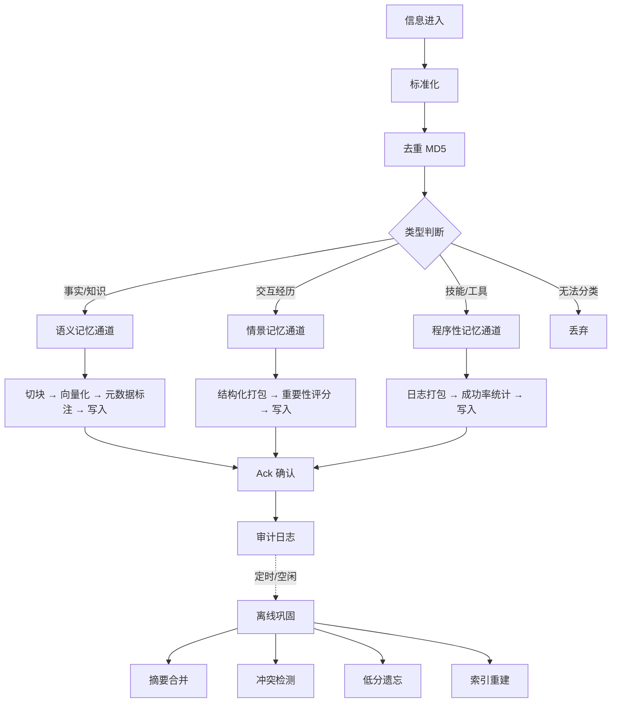

# 记忆存储需求文档（v0.3 — 完整版）

> **版本**: v0.3
> **日期**: 2026-07-06
> **来源**: genesis/ 下全部 4 份文档的综合
> **状态**: 完整草案

---

## 1. 整体流程

---

## 2. 信息进入

### 2.1 触发源

| 源 | 示例 | 典型 modality |
|----|------|---------------|
| 用户对话 | 聊天消息 | `chat` |
| 上传文件/文档 | 笔记、文章、论文 | `text` |
| 外部 API 推送 | 系统通知、数据导入 | `text` |
| 系统日志/行为 | 工具调用记录 | `action` |

### 2.2 时间约束

- 信息进入后应在 **≤ 500ms** 内完成标准化和类型判断，移交存储通道。
- 超时未处理的原始数据自动丢弃（模拟感官遗忘）。

---

## 3. 标准化

- **格式统一**：所有输入转为结构化格式（JSON 或纯文本）。
- **去重**：计算 MD5 指纹，与已有记忆比对。重复内容拒绝入库，返回已有记忆 ID。
- **语言检测**：标记主要语言（暂不实现，P3）。

---

## 4. 类型判断与分流

根据内容特征分流到三个通道：

| 类型 | 判断依据 | 目标通道 | modality |
|------|----------|----------|----------|
| 事实/知识 | 陈述性内容、可验证 | 语义记忆 | `text` |
| 交互经历 | 对话轮次、用户-AI 交互 | 情景记忆 | `chat` |
| 技能/工具 | 工具调用、API 请求 | 程序性记忆 | `action` |
| 垃圾 | 无法归类、低质噪声 | 丢弃 | — |

---

## 5. 记忆类型详述

### 5.1 语义记忆（事实/知识）

**存什么**：事实、概念、文档知识、可复用的信息。

**写入流程**：

1. **文档切块**：按语义边界切割（段落/句子级别），避免过长 chunk 降低检索精度。
2. **向量化**：计算 embedding 向量。
3. **元数据标注**：`source_id`、`timestamp`、`doc_type`（来源类型）、`version`（版本号）。
4. **写入向量存储**。

**生命周期**：固化后不随时间淡出，除非被新版本替代（软标记 deprecated）。

**检索方式**：向量相似度检索（余弦距离），辅以权威性加权（`doc_type` 官方 > 个人 > 推断）。

### 5.2 情景记忆（交互经历）

**存什么**：对话历史、交互片段、个人经历。

**写入流程**：

1. **结构化打包**：`{user_id, timestamp, user_input, ai_output, emotion_tag}`。
2. **重要性评分**：`importance = duration × 0.4 + urgency × 0.3 + repetition × 0.3`，范围 [0,1]。
3. **写入关系存储**。

**重要性评分细则**：

| 分量 | 计算方式 | 范围 |
|------|----------|------|
| 互动时长 | 对话轮数/时长归一化 | [0,1] |
| 紧急度 | 含"立刻""紧急"等关键词加权 | [0,1] |
| 重复提及 | 跨会话重复提及频率归一化 | [0,1] |

**生命周期**：随强度衰减。强度 = `importance × recency × reinforcement`。低于阈值且已固化 → 降为冷状态（cold，潜意识）。

**检索方式**：字面匹配（jaccard + 查询覆盖率）→ 双链扩展 → 向量重排。

### 5.3 程序性记忆（技能/工具）

**存什么**：工具调用日志、技能使用记录、成功率统计。

**写入流程**：

1. **工具调用日志打包**：`{user_id, tool_name, params, result, success_flag}`。
2. **成功率统计聚合**：同一工具的成功率 / 平均耗时。
3. **写入行为存储**。

**生命周期**：只增不减。记录不断累积，用于后续工具推荐。

**检索方式**：按工具名称检索，返回历史成功率和平均耗时，用于推荐最优工具。

---

## 6. 数据模型

### 6.1 通用字段

| 字段 | 类型 | 必填 | 默认值 | 说明 |
|------|------|------|--------|------|
| `id` | str | 是 | UUID hex[:12] | 唯一标识 |
| `content` | str | 是 | — | 记忆全文 |
| `importance` | float | 是 | 0.5 | 重要性 [0,1] |
| `modality` | str | 是 | `"text"` | 模态：`text/chat/action/reflection` |
| `timestamp` | float | 是 | 当前时间 | 编码时间（epoch seconds） |
| `last_recalled` | float | 是 | `timestamp` | 最近一次被想起的时间 |
| `recall_count` | int | 是 | 0 | 被想起的次数 |
| `state` | str | 是 | `"active"` | `active` / `cold` |
| `consolidated` | bool | 是 | `False` | 是否已固化 |
| `embedding` | list[float] \| None | 否 | `None` | 向量嵌入 |
| `embedding_model_version` | str \| None | 是* | `None` | 产生 embedding 的模型版本 |
| `source_ids` | list[str] | 是 | `[]` | 源记忆 ID 列表（reflection 用） |
| `status` | str | 是 | `"active"` | `active` / `deprecated` / `invalid` |

> *`embedding_model_version` 在有 embedding 时必填，无 embedding 时为 `None`。

### 6.2 语义记忆特有字段

| 字段 | 类型 | 说明 |
|------|------|------|
| `doc_type` | str | 来源类型：`official` / `personal` / `inferred` |
| `version` | int | 版本号，递增 |
| `superseded_by` | str \| None | 被哪条记忆替代 |

### 6.3 情景记忆特有字段

| 字段 | 类型 | 说明 |
|------|------|------|
| `user_id` | str \| None | 交互用户标识 |
| `user_input` | str \| None | 用户原始输入 |
| `ai_output` | str \| None | AI 原始回复 |
| `emotion_tag` | str \| None | 情绪标签：`neutral/happy/fear/corrected/...` |
| `urgency_level` | float \| None | 紧急度 [0,1] |

### 6.4 程序性记忆特有字段

| 字段 | 类型 | 说明 |
|------|------|------|
| `tool_name` | str | 工具名称 |
| `params` | dict \| None | 调用参数 |
| `result` | str \| None | 调用结果 |
| `success_flag` | bool | 是否成功 |
| `avg_latency` | float \| None | 平均耗时 |
| `success_rate` | float \| None | 成功率 [0,1] |

### 6.5 结构化摘要字段（所有类型通用）

| 字段 | 类型 | 说明 |
|------|------|------|
| `fact` | str \| None | 事实性摘要 |
| `opinion` | str \| None | 观点性摘要 |
| `experience` | str \| None | 经历性摘要 |

### 6.6 双链字段（所有类型通用）

| 字段 | 类型 | 说明 |
|------|------|------|
| `linked_ids` | list[str] | 双向关联的记忆 ID 列表 |

---

## 7. 写入与确认

- 每个通道写入完成后返回 **Ack**（包含 `id`、`channel`、`timestamp`）。
- 写入前校验元数据完整性：`content`、`timestamp`、`importance` 非空；有 embedding 时 `embedding_model_version` 非空。
- 校验失败则拒绝写入，返回错误。

---

## 8. 审计日志

所有写入、修改、提取操作生成结构化日志，追加写到 `memory/audit.jsonl`。

| 字段 | 类型 | 说明 |
|------|------|------|
| `operation` | str | `write` / `update` / `recall` / `consolidate` / `forget` / `conflict` |
| `item_id` | str | 操作的记忆 ID |
| `timestamp` | float | 操作时间 |
| `detail` | dict | 操作详情（JSON） |

**留存策略**：永久。

---

## 9. 检索机制

### 9.1 语义记忆检索

- **方式**：向量相似度检索（余弦距离）。
- **排序**：混合分 = `0.6 × 字面相关性 + 0.4 × 向量相似度`。
- **权威性加权**：`doc_type` 为 `official` 的乘以 1.2，`personal` 不调整，`inferred` 乘以 0.8。
- **Top-K**：默认 10，可配置。
- **相似度截断**：低于 0.65 的结果不返回。

### 9.2 情景记忆检索

- **三层检索**：
  1. **字面层**（承重）：`max(jaccard, 查询覆盖率)` × strength，粗筛 top-2k。
  2. **双链层**：对 top-k 的每条记忆，链入 `linked_ids` 中的 active 记忆（strength × 0.5）。
  3. **向量层**（伞）：若有 embedding，对候选集重排，取 top-k。
- **Chat 优先**：同等相关性分数下，`modality="chat"` 排在前面。
- **Floor 值**：0.1，确保强记忆即使不相关也能浮现。
- **Cold 排除**：`state="cold"` 的记忆不参与检索。

### 9.3 程序性记忆检索

- **方式**：按工具名称检索。
- **返回**：历史成功率、平均耗时、最近调用时间。
- **推荐**：成功率最高的工具优先推荐。

### 9.4 检索参数

| 参数 | 默认值 | 说明 |
|------|--------|------|
| `k` | 5 | 返回条数上限 |
| `similarity_threshold` | 0.65 | 相似度截断阈值 |
| `floor` | 0.1 | 最低相关性地板 |
| `expand_factor` | 2k | 字面层候选扩展倍数 |

---

## 10. 离线巩固

### 10.1 触发

- **定时**：每日凌晨 2:00（CronJob）。
- **空闲时**：系统无活跃请求时。
- **约束**：执行时长 ≤ 30 分钟，超时中断。

### 10.2 任务池

| 任务 | 触发条件 | 说明 |
|------|----------|------|
| **低分遗忘** | 每次巩固 | `importance < 0.2` 且距今 > 90 天 → 软删除（归档） |
| **对话摘要合并** | 每次巩固 | 同一用户的 N 轮对话 → 1 条高阶摘要 |
| **冲突检测与标注** | 每次巩固 | 同一实体出现新版本 → 标记旧版为 deprecated |
| **向量索引重建** | 新增文档 > 1000 篇 | 重新计算向量索引 |

### 10.3 低分遗忘规则

- **条件**：`importance < 0.2` AND `age > 90 天` AND `consolidated = True`。
- **操作**：`state = "cold"`（不删除，仅降为冷状态）。
- **铁律保护**：`consolidated = False` 的记忆永不降级。
- **日志**：记录遗忘的操作到审计日志（`operation = "forget"`）。

### 10.4 对话摘要合并

- **条件**：同一 `user_id` 下连续 N 轮对话（N 可配置，默认 5）。
- **操作**：将 N 轮对话合并为 1 条 `modality="reflection"` 的高阶摘要。
- **源链接**：摘要的 `source_ids` 指向被合并的原始对话 ID。

### 10.5 冲突检测

- **条件**：新记忆与已有记忆在语义上高度相似但内容矛盾。
- **操作**：标记旧记忆 `status = "deprecated"`，`superseded_by = 新记忆 ID`。
- **铁律**：禁止硬删除，只软标记。

---

## 11. 核心铁律

| 编号 | 铁律 | 说明 |
|------|------|------|
| **F-1** | 没固化不准忘 | 未 consolidate 的记忆永不降级到 cold |
| **F-2** | 软删除 | 记忆只降状态（active → cold），不硬删除 |
| **F-3** | 元数据 100% 完整 | 任何写入必须带 source_id、timestamp、embedding_model_version |
| **F-4** | 冲突禁止覆盖 | 发现新版本只标记旧版 deprecated，不删除 |
| **F-5** | 情景与语义物理隔离 | 不同记忆类型分属不同存储，严禁混合检索 |
| **F-6** | 提取即再巩固 | 每次召回时记录提取次数，>5 次后优先级自动提升 |
| **F-7** | 工具记忆只增不减 | 程序性记忆中的工具记录只追加不修改 |
| **F-8** | 全链路审计 | 所有写入、修改、提取操作生成结构化日志 |
